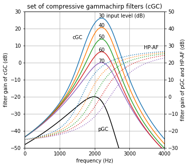
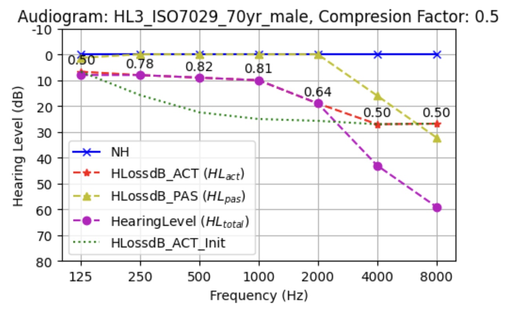
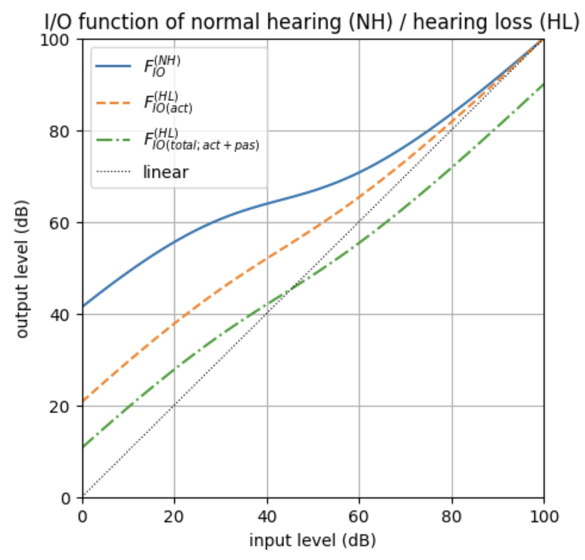

# GammachirPy

A Python package of the dynamic compressive gammachirp filterbank

<div style="text-align: center">
    
</div>

## Updates
- May, 2024
    - **Add: the new version ([v234](https://github.com/kyama0321/gammachirpy/blob/main/gcfb_v234)) :tada: , a frame-based processing with hearing loss characteristics ([Irino, 2023](https://doi.org/10.1109/ACCESS.2023.3298673))** 
    - Update: some functions for the previous version ([v211](https://github.com/kyama0321/gammachirpy/blob/main/gcfb_v211)) 

## Links

- GitHub: [https://github.com/kyama0321/gammachirpy](https://github.com/kyama0321/gammachirpy)
- Documents: T.B.D.

## What is the Dynamic Compressive Gammachirp Filterbank?

- The dynamic compressive gammachirp filterbank (dcGC-FB) is a time-domain and non-linear cochlear processing model ([Irino and Patterson, 2006](https://ieeexplore.ieee.org/document/1709909)).

<div style="text-align: center">
    
</div>

- The compressive gammachirp auditory filter (cGC) consists of a passive gammachirp filter (pGC) and a high-pass asymmetric function (HP-AF).
  
- The HP-AF shifts in frequency with stimulus level as dictated by data on the compression of basilar membrane motion.

<div style="text-align: center">
    
</div>

- The dcGC-FB contains a fast-acting level control circuit for the cGC filter, and it can explain:
  - level-dependent and asymmetric auditory filter shape
  - masking patterns and excitation patterns
  - fast compression (cochlear amplifier)
  - two-tone supression.

<div style="text-align: center">
    
    
    
</div>

- The Gammachirp filter explains a notched-noise masking data well for normal hearing and hearing impaired listeners ([Patterson+, 2003](https://doi.org/10.1121/1.1600720); [Matsui+, 2016](https://asa.scitation.org/doi/10.1121/1.4970396)).

- **The new version (gcfb_v234) includes hearing loss characteristics ([Irino, 2023](https://doi.org/10.1109/ACCESS.2023.3298673))**
    - **audiograms with compression factor $\alpha$**
    - **Input/output functions with compression factor $\alpha$ and audiogram**

    <div style="text-align: center">
      
      
    </div>
  
- The MATLAB packages of the original Gammachirp filterbank are [HERE](https://github.com/AMLAB-Wakayama/gammachirp-filterbank).

## About the GammachirPy Project

- The project name, "GammachirPy (がんまちゃーぴー)" is "Gammachirp + Python".

- This project aims to translate the original MATLAB codes to Python and share them as an open-source software ([Apache-2.0 license](https://github.com/kyama0321/gammachirpy/blob/main/LICENSE.md)).
  
- I have made some demo scripts of the Jupyter Notebook for educational uses. You can also open and execute them of Google Colaboratory. See **gcfb_v211/demo_*.ipynb** and **gcfb_v234/demo_*.ipynb** files.

## Repository Structure

- The directory structure is almost the same as the original MATLAB page.
  - **[gcfb_v211](https://github.com/kyama0321/gammachirpy/tree/main/gcfb_v211)**: sample-by-sample processing version
  - **[gcfb_v234](https://github.com/kyama0321/gammachirpy/tree/main/gcfb_v234)**: a new frame-based processing version for Wadai Hearing Impaired Simulator (WHIS)

- In each version, the directory mainly contains:
  - **gcfb_v\*.py**: dynamic compressive gammachirp (dcGC) filter
  - **gammachirp.py**: passive gammachirp (pGC) filter
  - **utils.py**: useful functions for auditory signal processing
  - **test_gcfb_v\*_{pulse/speech}.py**: test and demo scripts for practical uses as a plain Python file.
  - **demo_gcfb_v\*_{pulse/speech}.ipynb**: demo scripts for practical uses on the Jupyter Notebook. The scripts are based on test_gcfb_v*_{pulse/speech}.py.
  - **demo_gammachirp.ipynb**: demo scripts for educational uses of the dcGC-FB on the Jupyter Notebook
  - **/sample**: a speech file
  - **/original**: outputs of original Gammachirp filterbank (*.mat) 

## Requirements

- Python >= 3.11.1
- NumPy >= 1.26.4
- SciPy >= 1.10.1
- Matplotlib >= 3.7.1
- Jupyter >= 1.0.0

Please see more information in [requirements.txt](https://github.com/kyama0321/gammachirpy/blob/main/requirements.txt).

## Installation

1. fork/clone the gammachirpy repository
    ```bash
    git clone https://github.com/kyama0321/gammachirpy
    cd gammachirpy
    ```

2. If you use "venv":
    ```bash
    python3.11 -m venv venv
    . venv/bin/activate
    pip install --upgrade pip
    # pip install setuptools # if you fail to install packages
    pip install -r requirements.txt
    ```

## Getting Started

Please see the README file in each directory.

  - **[gcfb_v211](https://github.com/kyama0321/gammachirpy/tree/main/gcfb_v211)**: sample-by-sample processing version
  - **[gcfb_v234](https://github.com/kyama0321/gammachirpy/tree/main/gcfb_v234)**: a new frame-based processing version for Wadai Hearing Impaired Simulator (WHIS)

## Reproducibility

- In the **[gcfb_v234/demo_gammachirp.ipynb](https://github.com/kyama0321/gammachirpy/blob/main/gcfb_v234/demo_gammachirp.ipynb)**, essential characteristics of the gammachirp filterbank are explained and checked with the GammachirPy package.

    [](https://colab.research.google.com/github/kyama0321/gammachirpy/blob/main/gcfb_v211/demo_gammachirp.ipynb)

- In the **[gcfb_v211/demo_gcfb_v211_pulse.ipynb](https://github.com/kyama0321/gammachirpy/blob/main/gcfb_v211/demo_gammachirp.ipynb)** and **[gcfb_v234/demo_gcfb_v234_pulse.ipynb](https://github.com/kyama0321/gammachirpy/blob/main/gcfb_v234/demo_gammachirp.ipynb)**, a simple pulse train are used as an input signal with some sound pressure levels (SPLs) to compare outputs of the GammachirPy and the original Gammachirp.

<div style="text-align: center">
    
</div>

- In the latest release, the root-mean-squared error (RMSE) between output signals (cgc_out) of the GammachirPy and the original Gammachirp in each level is:

    - v211 (sample-by-sample processing)

       [](https://colab.research.google.com/github/kyama0321/gammachirpy/blob/main/gcfb_v211/demo_gcfb_v211_pulse.ipynb)

        | gcfb | SPL (dB) | RMSE |
        | --- | --- | --- |
        | v211 | 40 | 4.11e-14 |
        | v211 | 60 | 2.25e-13 |
        | v211 | 80 | 1.73e-12 |

    - v234 (frame-based processing with hearing loss characteristics)
      - NH: normal hearing
      - HL3: hearing loss type #3 (ISO-7029; 70 year old, male)

      [](https://colab.research.google.com/github/kyama0321/gammachirpy/blob/main/gcfb_v234/demo_gcfb_v234_pulse.ipynb)

        | gcfb | NH/HL | SPL (dB) | RMSE |
        | --- | ---  | --- | --- |
        | v234 | NH | 40 | 1.10e-16|
        | v234 | NH | 60 | 7.42e-16|
        | v234 | NH | 80 | 4.08e-15|
        | v234 | HL3 | 40 | 4.14e-17|
        | v234 | HL3 | 60 | 3.06e-16|
        | v234 | HL3 | 80 | 2.04e-15|

- There are still small errors between the GammachirPy and the original Gammachirp. I would like to improve them with code refactorings in the future:-)

## :warning: Compatibility Note :warning:
- Please be aware that the original [firpm](https://jp.mathworks.com/help/signal/ref/firpm.html) function in MATLAB is incompatible with the [scipy.signal.remez](https://docs.scipy.org/doc/scipy/reference/generated/scipy.signal.remez.html) function in GammachirPy code and the [firmpm](https://octave.sourceforge.io/signal/function/firpm.html) function in Octave due to the specifications of input arguments. The function is used for outer and middle ear corrections (`utils.out_mid_crct_filt`). You can use the frequency correction with options such as "ELC," "FreeField," and "EarDrum," but the phase characteristics are slightly different from the original Gammachirp outputs. 

## Acknowledgements

The packages is inspired from [AMLAB-Wakayama/gammachirp-filterbank](https://github.com/AMLAB-Wakayama/gammachirp-filterbank) by [Prof. Toshio Irino](https://web.wakayama-u.ac.jp/~irino/index-e.html), Auditory Media Laboratory, Wakayama University, Japan.

## References

- [R. D. Patterson, M. Unoki, and T. Irino "Extending the domain of center frequencies for the compressive gammachirp auditory filter," J. Acoust. Soc. Am., 114 (3), pp.1529-1542, 2003.](https://doi.org/10.1121/1.1600720)
- [T. Irino and R. D. Patterson, "A dynamic compressive gammachirp auditory filterbank" IEEE Trans. Audio, Speech, and Language Process., 14(6), pp.2222-2232, 2006.](https://doi.org/10.1109/TASL.2006.874669)
- [T. Irino, "An introduction to auditory filter," J. Acoust. Soc. Jpn., 66(10), pp.505-512, 2010. (in Japanese)](https://doi.org/10.20697/jasj.66.10_506)
- [T. Matsui, T. Irino, H. Inabe, Y. Nishimura and R. D. Patterson, "Estimation of auditory compression and filter shape of elderly listeners using notched noise masking," J. Acoust. Soc. Am., 140, p.3274, 2016.](https://asa.scitation.org/doi/10.1121/1.4970396)
- [T. Irino and R. D. Patterson, "The gammachirp auditory filter and its application to speech perception," Acoust. Sci. & Tech., 41(1), pp.99-107, 2020.](https://doi.org/10.1250/ast.41.99)
- [T. Irino, “Hearing Impairment Simulator Based on Auditory Excitation Pattern Playback: WHIS,” IEEE Access, 11, pp. 78419–78430, 2023.](https://doi.org/10.1109/ACCESS.2023.3298673)