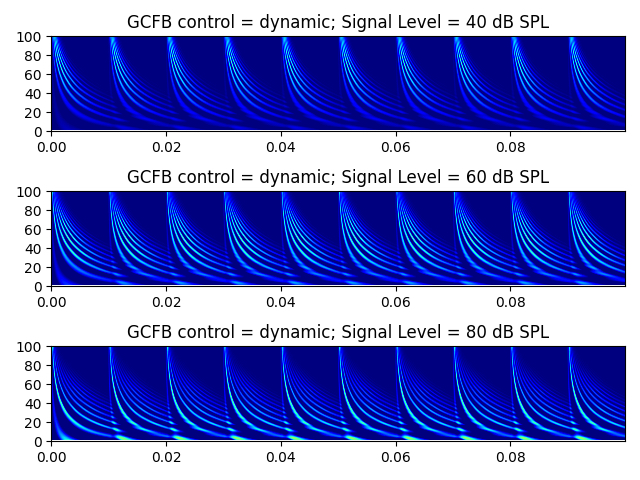
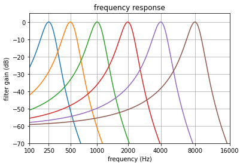
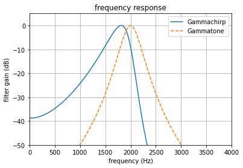
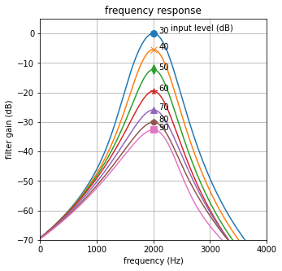
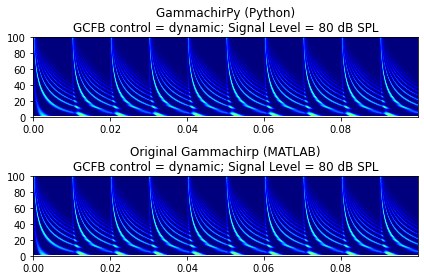
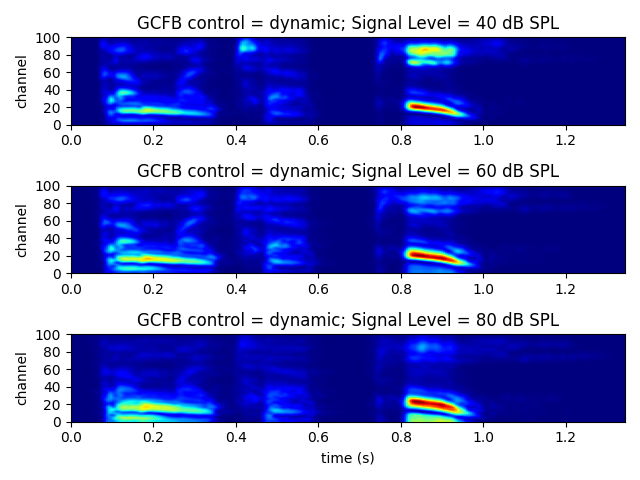

# GammachirPy

A Python package of the dynamic compressive gammachirp filterbank

<!--  -->


## Links

- GitHub: [https://github.com/kyama0321/gammachirpy](https://github.com/kyama0321/gammachirpy)
- Documents: T.B.D.


## What is the Dynamic Compressive Gammachirp Filterbank?

- The dynamic compressive gammachirp filterbank (dcGC-FB) is a time-domain and non-linear cochlear processing model ([Irino and Patterson, 2006](https://ieeexplore.ieee.org/document/1709909)).



- The dcGC-FB can represent:
  - level-dependent and asymmetric auditory filter shape
  - masking patterns and excitation patterns
  - fast compression (cochlear amplifier)
  - two-tone supression.






- The Gammachirp filter explains a notched-noise masking data well for normal hearing and hearing impaired listeners ([Patterson+, 2003](https://doi.org/10.1121/1.1600720); [Matsui+, 2016](https://asa.scitation.org/doi/10.1121/1.4970396)).
  
- The MATLAB packages of the original Gammachirp filterbank are [HERE](https://github.com/AMLAB-Wakayama/gammachirp-filterbank).

## About the GammachirPy Project

- The project name, "GammachirPy (がんまちゃーぴー)" is "Gammachirp + Python".

- This project aims to translate the original MATLAB codes to Python and share them as an open-souce software ([Apache-2.0 license](https://github.com/kyama0321/gammachirpy/blob/main/LICENSE.md)).
  
- In addition, I have made some demo scripts of the Jupyter Notebook for educational uses. See **[gcfb_v211/demo_gammachirp.ipynb](https://github.com/kyama0321/gammachirpy/blob/main/gcfb_v211/demo_gammachirp.ipynb)** files.

## Reproducibility

- In the **[gcfb_v211/demo_gammachirp.ipynb](https://github.com/kyama0321/gammachirpy/blob/main/gcfb_v211/demo_gammachirp.ipynb)**, basic characteristics of the gammachirp filterbank has been explained and checked with the GammachirPy package.
  
- In the **[gcfb_v211/demo_gcfb_v211_pulse.ipynb](https://github.com/kyama0321/gammachirpy/blob/main/gcfb_v211/demo_gammachirp.ipynb)**, a simple pulse train has been used as an input signal with some sound pressure levels (SPLs) to compare outputs of the GammachirPy and the original Gammachirp.
  


- In the latest release, the root-mean-squared error (RMSE) between output signals (cgc_out) of the GammachirPy and the original Gammachirp in each level is:

    | gcfb | SPL (dB) | RMSE |
    | --- | --- | --- |
    | v211 | 40 | 4.11e-14 |
    | v211 | 60 | 2.26e-13 |
    | v211 | 80 | 1.75e-12 |

- There are still some errors between the GammachirPy and the original gammachirp, but the errors are minimal. I would like to improve them in the future:-)

## Repository Structure

- The directory structure is almost the same as the original MATLAB page, and this repository will contain different versions in the future.
  - **[gcfb_v211](https://github.com/kyama0321/gammachirpy/tree/main/gcfb_v211)**: sample-by-sample processing version
  - **gcfb_v221 (T.B.D.)**: frame-basd processing version
  - **gcfb_v233 (T.B.D.)**: new schemes for Wadai Hearing Impaired Simulator (WHIS)

- In each version, the directory mainly contains:
  - **gcfb_v\*.py**: dynamic compressive gammachirp (dcGC) filter
  - **gammachirp.py**: passive gammachirp (pGC) filter
  - **utils.py**: useful functions for auditory signal processing
  - **test_gcfb_v\*_{pulse/speech}.py**: test and demo scripts for practical uses as a plain Python file.
  - **demo_gcfb_v\*_{pulse/speech}.ipynb**: demo scripts for practical uses on the Jupyter Notebook. The scripts are based on test_gcfb_v*_{pulse/speech}.py.
  - **demo_gammachirp.ipynb**: demo scripts for educational uses of the dcGC-FB on the Jupyter Notebook


## Requirements

- Python >= 3.9.1
- NumPy >= 1.23.1
- SciPy >= 1.8.1
- Matplotlib >= 3.5.2
- Jupyter >= 1.0.0

Please see more information in [requirements.txt](https://github.com/kyama0321/gammachirpy/blob/main/requirements.txt).

## Installation

    git clone https://github.com/kyama0321/gammachirpy
    cd gammachirpy

    # If you use "venv"
    python3 -m venv venv
    . venv/bin/activate
    pip install -r requirements.txt

## Getting Started

The following guide is based on **[gcfb_v211/demo_gcfb_v211_speech.ipynb](https://github.com/kyama0321/gammachirpy/blob/main/gcfb_v211/demo_gcfb_v211_speech.ipynb)**.

1. Import packages.
   
    ```Python
    import numpy as np
    import matplotlib.pyplot as plt

    import utils
    import gcfb_v211 as gcfb
    ```
   
2. Set default parameters for the gammachirp filterbank as a class variables. Note that if you don't set any parameters, **gcfb.dcgc_v\*()** automaticaly set a default paramters determined in **gcfb.set_param()**

    ```python
    class GCparamDefault:
          fs = 48000 # sampling frequency
          num_ch = 100 # number of channels
          f_range = np.array([100, 6000]) # range of center frequencies
          out_mid_crct = 'ELC' # equal loudness contour (ELC)
          ctrl = 'dynamic' # time-varying
    ```

3. Read an audio sound and normalize the signal's amplitude (-1 ~ +1). I recomend to use **utils.audioread()**. Note that the recommended sampling frequency of the input sound is 48,000 Hz.

    ```python
    # read the sample speech
    path_file = './sample/snd_gammachirpy.wav'
    snd, fs = utils.audioread(path_file)
    ```

4. Adjust the input signal level as a sound pressure level (SPL) by **utils.eqlz2meddis_hc_level()**.

    ```python
    # sound pressure level (SPL)
    dbspl = 40
    # Level equalization
    snd_eq, _ = utils.eqlz2meddis_hc_level(snd, dbspl)
    ```

5. Analyze the input signal by **gcfb.gcfb_v\*()** with default parameters.

    ```python
    # GCFB
    gc_param = GCparamDefault()
    cgc_out, pgc_out, _, _ = gcfb.gcfb_v211(snd_eq, gc_param)
    ```

6. You can get the temporal output signals (num_ch $\times$ len(snd)) as :
   - **cgc_out**: outputs of the dynamic "compressive" gammachirp filterbank (dependent on the input signal level)
   - **pgc_out**: outputs of the "passive" gammachirp filterbank (not dependent on the input signal level)


7. If you change a parameter of an input sound pressure level, you can get and compare different outputs (**cgc_out**) from the dynamic compressive gammachirp filterbank. For exmaple, the below figure is available at **[gcfb_v211/test_gcfb_v211_speech.py](https://github.com/kyama0321/gammachirpy/blob/main/gcfb_v211/test_gcfb_v211_speech.py)**.

    

## Acknowledgements

The packages is inspired by [AMLAB-Wakayama/gammachirp-filterbank](https://github.com/AMLAB-Wakayama/gammachirp-filterbank) ([Prof. Toshio Irino](https://web.wakayama-u.ac.jp/~irino/index-e.html), Auditory Media Laboratory, Wakayama University, Japan).

## References

- [R. D. Patterson, M. Unoki, and T. Irino "Extending the domain of center frequencies for the compressive gammachirp auditory filter," J. Acoust. Soc. Am., 114 (3), pp.1529-1542, 2003.](https://doi.org/10.1121/1.1600720)
- [T. Irino and R. D. Patterson, "A dynamic compressive gammachirp auditory filterbank" IEEE Trans. Audio, Speech, and Language Process., 14(6), pp.2222-2232, 2006.](https://doi.org/10.1109/TASL.2006.874669)
- [T. Irino, "An introduction to auditory filter," J. Acoust. Soc. Jpn., 66(10), pp.505-512, 2010. (in Japanese)](https://doi.org/10.20697/jasj.66.10_506)
- [T Matsui, T. Irino, H. Inabe, Y. Nishimura and R. D. Patterson, "Estimation of auditory compression and filter shape of elderly listeners using notched noise masking," J. Acoust. Soc. Am., 140, p.3274, 2016.](https://asa.scitation.org/doi/10.1121/1.4970396)
- [T. Irino and R. D. Patterson, "The gammachirp auditory filter and its application to speech perception," Acoust. Sci. & Tech., 41(1), pp.99-107, 2020.](https://doi.org/10.1250/ast.41.99)
