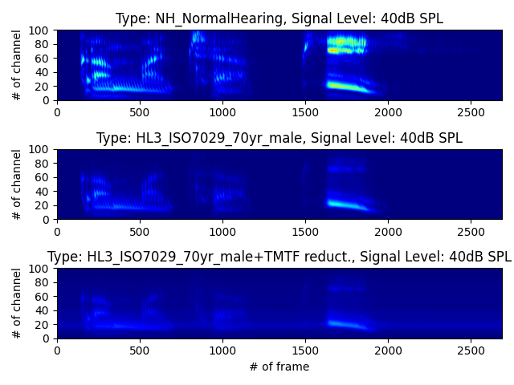

# gcfb_v234

A new frame-based processing version of the dynamic compressive gammachirp filterbank for Wadai Hearing Impaired Simulator (WHIS)

## Getting Started

The following instruction is based on **[gcfb_v234/demo_gcfb_v234_speech.ipynb](https://github.com/kyama0321/gammachirpy/blob/main/gcfb_v234/demo_gcfb_v234_speech.ipynb)**.

1. Import packages.

    ```python
    import numpy as np
    import matplotlib.pyplot as plt

    import utils
    import gcfb_v234 as gcfb
    ```

2. Set default parameters for the gammachirp filterbank as class variables. Note that if you don't set any parameters, **gcfb.dcgc_v234*()** automaticaly set default paramters determined in **gcfb.set_param()**

    ```python
    class GCparamDefault:
        # --- basic paramters
        fs = 48000 # sampling frequency
        num_ch = 100 # number of channels
        f_range = np.array([100, 6000]) # range of center frequencies
        
        # --- outer & middle ear correlations
        out_mid_crct = "No" # outer & middle ear correlations
        #out_mid_crct = "FreeField" # outer & middle ear correlations
        
        # --- time-varying setting
        ctrl = "dynamic" # used to be 'time-varying'
        
        # --- frame-base or sample-base processing
        dyn_hpaf_str_prc = 'frame-base'
        
        # --- hearing-loss patterns and compression health \alpha
        hloss_type = 'NH' # normal hearing listeners
    ```

3. Read an audio sound and normalize the signal's amplitude (-1 ~ +1). I recomend to use **utils.audioread()**. Note that the recommended sampling frequency of the input sound is 48,000 Hz.

    ```python
    # stiuli : a sample speech sound
    file_name = 'snd_gammachirpy.wav'
    path_dir = './sample/'
    path_file = path_dir + file_name
    ```

4. Adjust the input signal level as a sound pressure level (SPL) by **utils.eqlz2meddis_hc_level()**.

    ```python
    # sound pressure level (SPL)
    dbspl = 40

    # sound pressure level (SPL)
    digital_rms1_dbspl = 90 # for calibration
    snd_digital_level_db = dbspl - digital_rms1_dbspl
    snd_src1 = 10**(snd_digital_level_db/20)/utils.rms(snd) * snd
    snd_eq_m, _ = utils.eqlz2meddis_hc_level(snd_src1, [], digital_rms1_dbspl)
    ```

5. Analyze the input signal by **gcfb.gcfb_v\*()** with default parameters.

    ```python
    # GCFB
    gc_param = GCparamDefault()
    gc_param.hloss_type = 'NH' # normal hearing listener
    #gc_param.hloss_type = 'HL3' # hearing loss type No.3
    dcgc_out, _, gc_param, gc_resp = gcfb.gcfb_v234(snd_eq_m, gc_param)
    ```

6. You can get the temporal output signals (`num_ch` $\times$ `#frames`) as :
   - **dcgc_out**: "frame-based" outputs of the dynamic "compressive" gammachirp filterbank (dependent on the input signal level)

7. If you change the SPL (`dbspl`) and hearing loss type (`gc_param.hloss_type`), you can get and compare different outputs (`dcgc_out`) from the dynamic compressive gammachirp filterbank. For example, the below figure is available at **[gcfb_v234/test_gcfb_v234_speech.py](https://github.com/kyama0321/gammachirpy/blob/main/gcfb_v234/test_gcfb_v234_speech.py)**.

<div style="text-align: center">
    
</div>